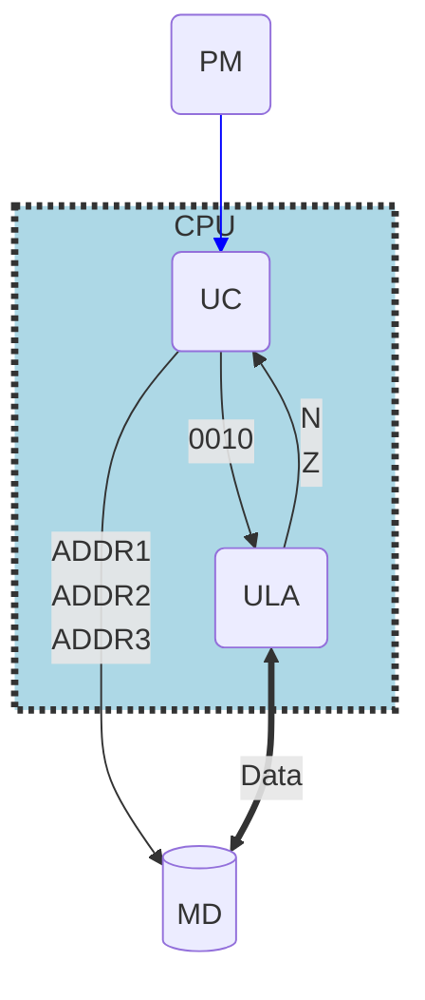
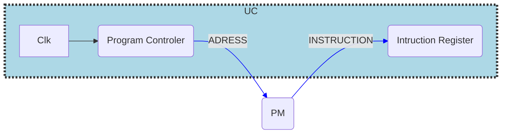

Status: #study 
Tags:
[[CEFET]], [[AOC]]
## Diagrama de máquina de 1ª Geração

> PM = Memória de Programa
> UC = Unidade de controle
> ULA = Unidade de Lógica e Aritmética
> DM = Memória de dados

## Ciclo de máquina
1. Busca da instrução
2. Decodificação
3. Execução
#Eficiencia 

## Software Básico (ISA)
1. Operações Matemáticas
2. Desvios (Go to,if,...)
3. Acesso à memória (load, store, read, write)

*Como visto na [[AOC 1ª - Aula]] é aqui onde aparece as principais diferenças entre RISC X CISC.*

## Diagrama da unidade de Controle

