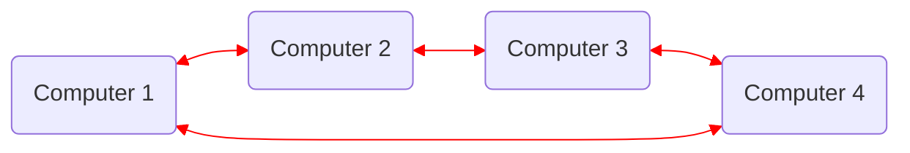

Status: #study 
Tags:
[[CEFET]], [[AOC]]
### Relembrando
 - Ciclo de instrução visto na [[AOC 3ª - Aula]]

### Ciclo de operação
![[pipe_line_Instruction_SandParalel.png]]
*p.51*

#### Da errado quando
- Uma instrução depende da outra. (Execução de instrução por prioridade).
- Quando existe a necessidade de uma variável fora da memória [[AOC - Cache]].
### Paralelismo
![[Mult_CPU.png]]
*p.56*
### <u>Cluster</u>

> RACE
